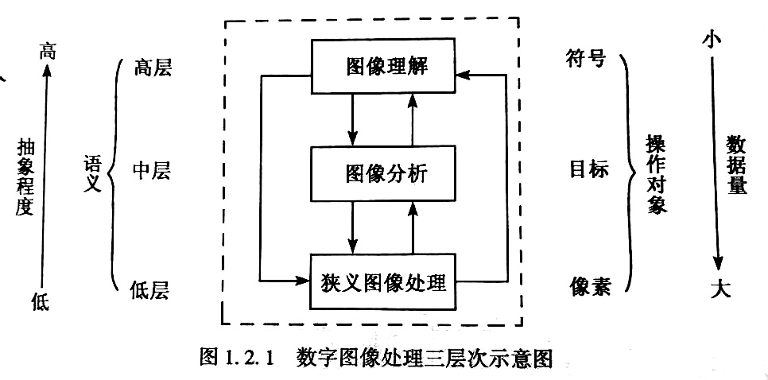

# 数字图像处理作业
- 姓名：罗运
- 学号：2017301110134
# 课后习题
- P10 1.2
- P44 1.2.3.6.7.10.11
- P67 1.7.11.12.17
- P103 1.3.4
- P104 7.8.9.10.11.13.14.16.17.18.19
- P123 1.2.4.6
- P144 1.3
- P169 5.6.7.8
- P196 5.6.8
- P216 1.5
- P231 1.3

# 第一章 导论
## P10 1 什么是图像？模拟图像处理与数宇图像处理主要区别表现在哪些方面？
- 图像
    - 对客观对象的一种相似性的、生动性的描述或写真
- 按照描述模型（空间坐标和色彩亮度的连续性）可以分为:
    - 模拟图像
        - 模拟图象可用连续函数来描述。
        - 其特点：光照位置和光照强度均为连续变化的。
    - 数字图像
        - 数字图像是图像的数字表示，像素是其最小的单位，用矩阵或数组来描述
        - 空间坐标和灰度均不连续的、用离散数字表示的图像

## P10 2 数字图像处理包括哪几个层次?各层次之间有何区别和联系?
- 图像处理
    - 模拟图像处理
    - 数字图像处理
- 数字图像处理分为三个层次
    - 狭义图像处理
        - 对输入图像进行某种变换得到输出图像。图像到图像的过程
        - 低层操作，像素级处理，数据量大
    - 图像分析
        - 对图像中感兴趣的目标进行检测，建立对图像目标的描述。图像到数值或符号的过程。
        - 以观察者为中心
        - 中层操作，分隔、特征提取，像素到非图像形式的描述
    - 图像理解
        - 图像分析基础上，基于人工智能和认知理论研究图像中各目标的性质和它们之间的联系，对图像内容的含义加以理解、解译。
        - 以客观世界为中心
        - 高层操作，对描述中抽象的符号进行推理
> 从低层到高层，抽象程度提高，数据量减少。逐步转为有组织、用途的信息。语义不断引入，操作对象发生变化，数据量被压缩。  
高层操作对低层操作有指导作用，能提高低层操作的效率。

# 第二章 数字图像处理基础
## P44 1 什么是图像对比度?人眼感受的亮度与哪些因素有关?
- 图像对比度是图像中最大亮度$B_{max}$与最小亮度$B_{min}$之比。
    - $C_1 = B_{min} / B_{max}$
- 人眼对亮度差别的感觉取决于相对亮度的变化。
    - 人眼在适应某一平均亮度时，黑、白感觉对应的亮度范围较小。随着平均亮度的下降，黑白感觉的亮度范围变窄。
- 人类的视觉系统有增强边缘对比度的机制

## P44 2 图像数字化包括哪两个过程?它们对数字化图像质量有何影响?
- 采样：将空间上连续的图像变成离散点的操作
    - 采样间隔
        - 各抽样点的间隔
    - 采样孔径
        - 形状和大小
    - 采样方式：相邻像素间的位置关系
        - 有缝、无缝、重叠采样
- 量化
    > 经采样，图像被分割成空间上离散的像素，但图像像素灰度是连续变化的，还不能用计算机处理。将像素灰度转换成离散的整数值的过程叫量化。
    - 灰度级数
        - 不同灰度值的个数
- 数字化方式
    - 均匀采样、量化
        - 均匀：采样、量化为等间隔
        - 常采用
    - 非均匀采样、量化
        - 很少采用
- 采样间隔：
    - 采样间隔越大，图像像素越少，空间分辨率越低，质量差。严重时出现像素呈块状的国际棋盘效应；
    - 采样间隔越小，所得图像像素越多，空间分辨率越高，图像质量好，但数据量大。
- 量化等级：
    - 量化等级越多，所得图像层次越丰富，灰度分辨率越高，质量越好，但数据量大；
    - 量化等级越少，图像层次欠丰富，灰度分辨率低，质量变差。会出现假轮廓现象，但数据量小。

- 一般，当限定数字图像的大小时, 为了得到质量较好的图像可采用如下原则：
    - 对缓变的图像，应该细量化，粗采样，以避免假轮廓
    - 对细节丰富的图像，应细采样，粗量化,以避免模糊（混叠）

## P44 3 数字化图像的数据量与哪些因素有关?
- 采样间隔
- 量化等级
> （见上题）

## P44 6 什么是灰度直方图?它有哪些应用?从灰度直方图你能获得图像的哪些信息?
- 灰度直方图概念：
    - 反映的是一副图像中各灰度级像素出现的频率之间的关系
    - 灰度级为横坐标
    - 灰度级的频率为纵坐标
    - 反映了图像灰度分布的情况
- 性质：
    - 只能反映灰度分布情况，不能反映图像像素的位置，丢失了像素的位置信息
    - 不同图像可有同一直方图
    - 多个区域直方图之和为原图像直方图
- 应用：
    - 判断图像量化是否恰当
        - 应该利用全部可能的灰度级
    - 确定图像二值化的阈值
    - 计算图像中物体的面积
    - 计算图像信息量H（熵）
        - 灰度范围为$[0, L-1]$，各灰度像素出现概率为$P_i$，各灰度像素具有的信息量为$-log_2P_i$，平均信息量（熵）为：
        - $H = - \sum_{i=0}^{L-1} P_ilog_2P_i$

## P44 7 设计显示数字图像直方图的程序，并用适当的图像检验程序的正确性。

## P44 10 什么是点处理?你所学算法中有哪些属于点处理?试举3种不同作用的点运算。
- 在局部处理中，当输出值仅与输入像素灰度有关的处理称为点处理
- 图像对比度增强
- 对比度拉伸
- 灰度变换
- 图像二值化
- 伪彩色变换
## P44 11 什么是局部处理?你所学算法中有哪些属于局部处理?试举3种不同作用的局部运算。
- 像素周围构成的集合叫作像素的邻域。常有4-邻域、8-邻域。
- 计算某一输出像素$JP(i,j)$值由输入图像$IP(i,j)$像素的小邻域$N[IP(i,j)]$中的像素值确定，称为局部处理
    - $JP(i,j)=\phi_N(N(i,j))$
    - $\phi_N$表示对(i,j)邻域中的像素进行的某种运算
    - 移动平均平滑法、空间域锐化都属于局部处理

# 第三章 图像变换
## P67 1 图像处理中正交变换的目的是什么?图像变换主要用于哪些方面?
- 图像变换的目的在于
    - 使图像处理问题简化
    - 有利于图像特征提取
    - 有助于从概念上增强对图像信息的理解
- 正交变换特点
    - 在变换域中，图像能量集中分布在低频率成分上
    - 边缘、线信息反映在高频率成分上
- 广泛应用在
    - 图像增强
    - 图像恢复
    - 特征提取
    - 图像压缩编码和形状分析
    
## P67 7 对上面图像分别进行二维哈达玛变换，并对计算结果加以分析。

## P67 11 什么是小波?小波函数是唯一的吗? 一个小波函数应满足哪些容许性条件?
- 小波，就是小的波形
    - 所谓小，是指它具有衰减性
    - 称之为波，是指它的波动性，其振幅正负相间的震荡形式
- 小波$\varphi(t)$的选择既不是唯一的，也不是任意的。
- 应满足条件
    - 定义域应是紧支撑的，即在一个很小的区间外，函数为0，也就是函数应有速降特性
    - 平均值为0
        - $\int_{-\infty}^{+\infty}\varphi(t)dt=0$

## P67 12 什么是尺度函数?它对小波构造有何意义?
- 尺度函数可以用来生成小波函数，有的人称之为父小波函数
- 尺度函数和小波函数分别是尺度空间（近似空间）和细节空间的基函数，两者通过双尺度方程联系

## P67 17 多尺度几何分析在图像表示方面有何优点?
- 多分辨性
- 局域化
- 方向性
- 各向异性
# 第四章 图像增强
## P103 1 图像增强的目的是什么?它包含哪些内容?
- 目的
    - 采用一系列技术改善图像的视觉效果，提高图像的清晰度
    - 将图像转换成一种更适合于人或机器进行分析处理的形式
- 图像增强内容
    - 空间域
        - 点运算
            - 灰度变换
                - 线性变换
                - 对数变换
                - 指数变换
            - 直方图修正法
                - 均衡化
                - 规定化
            - 局部统计法
        - 局部运算
            - 图像平滑
            - 图像锐化
    - 频率域
        - 高通滤波
        - 低通滤波
        - 同态滤波增强
    - 彩色增强
        - 伪彩色增强
        - 彩色图像增强
            - 常规处理
            - 假彩色增强
            - 彩色平衡
            - 彩色变换增强
    - 代数运算

## P103 3 直方图修正有哪两种方法?二者有何主要区别与联系?
- 直方图均衡化
    - 通过对原图像进行某种变换，使得原图像的灰度直方图修正为均匀的直方图的一种方法
    - 虽然均衡所得图像的灰度直方图不很平坦，灰度级数减少。但从分布来看，比原图像直方图平坦多了，而且动态范围扩大了。
    - 直方图均衡的实质是减少图像的灰度等级换取对比度的扩大
    - 近似均匀的直方图
    - 直方图规定化的一个特例
- 直方图规定化(直方图匹配)
    - 具有特定形状的直方图的图像，以便增强图像中某些灰度级
    - 是原图像灰度直方图变成规定形状的直方图而对图像作修正的增强方法
    - 是直方图均衡化的一种有效扩展。

## P103 4 在直方图修改技术中对变换函数的基本要求是什么?直方图均衡化处理采用何种变换函数?什么情况下采用直方图均衡法增强图像?
- 变换函数$T(r)$满足条件
    - 在0<=r<=1内为单调递增函数
    - 在0<=r<=1内有，0<=$T(r)$<=1
- $s = T(r) = \int_0^rp_r(r)dr$
- $s_k = T(r_k) = \sum_{j=0}^kp_r(r_j) = \sum_{j=0}^kn_j/n$
    - k = 0,1,2,...,L-1
- 大多数自然图像由于其灰度分布集中在较窄的区间，引起图像细节不够清晰。采用直方图修正够可使图像的灰度间距拉开或使灰度分布均匀，从而增大反差，使图像细节清晰。

## P104 7 何谓图像平滑?试述均值滤波的基本原理。
- 任何一副原始图像，在获取和传输等过程中，会受到各种噪声的干扰，使图像质量下降，特征湮没，对图像分析不利。为抑制噪声、改善图像质量所进行的处理称图像平滑或去噪。
- 均值滤波
    - 每个像元在以其为中心的邻域内取平均值来代替该像元值。
    - 原理是：在图像上，对待处理的像素给定一个模板，该模板包括了其周围的邻近像素。将模板中的全体像素的均值来替代原来的像素值的方法。
    - 均值滤波可以用来对椒盐噪声和高斯噪声进行滤波。

## P104 8 何谓中值滤波?其有何特点?
- 中值滤波
    - 是对一个滑动窗口内的诸像素灰度值排序，用其中值代替窗口中心像素的灰度值的滤波方法。
- 特点
    - 它是一种非线性的平滑法
    - 对脉冲干扰及椒盐噪声的抑制效果好，在抑制随机噪声的同时能有效保护边缘少受模糊
    - 但对点、线等细节较多的图像却不太合适
- 重要特性
    - 对离散阶跃信号、斜升信号不产生影响。连续个数小于窗口长度一般的离散脉冲将被平滑，三角函数的顶部平坦化
    - C为常数则
        - Med{CF} = CMed{F}
        - Med{C+F} = C+Med{F}
        - Med{F+f} != Med{F} + Med{f}m
    - 中值滤波后，信号频谱基本不变

## P104 9 对下图作3x3中值滤波处理，写出处理结果。
## P104 10 对上图作3x3邻域平均， 并比较邻域平均与中值滤波的差异。
- 邻域平均
    - 算法简单，处理速度快
    - 减低噪声的同时使图像产生模糊，特别是在边缘和细节处
    - 邻域增大，去噪能力增强的同时，模糊程度越严重
- 中值滤波
    - 能有效消弱椒盐噪声
    - 但在抑制随机噪声方面，中值滤波比均值滤波差一些

## P104 11 低通波法中常有几种滤波器?它们的特点是什么?
- 模版不同，邻域内各像素重要程度也不相同。

## P104 13 图像锐化处理有几种方法?计算第9题中图像的梯度。
- 梯度锐化法
- Laplacian增强算子
- 高通滤波法

## P104 14 何为同态增强处理?试述其基本原理。
- 概念
    - 同态滤波是一种在频域中同时将图像亮度范围进行压缩和对比度增强频域方法
- 原理
    - 图像$f(x,y)$可以表示为照度分量$i(x,y)$和反射分量$r(x,y)$的乘积
    - 一般照度分量在空间域变化缓慢，而反射分量在不同物体的交界处是急剧变化的。
    - 所以图像对数的傅立叶变换中，低频部分主要对应照度分量，而高频部分主要对应反射分量。
    - 因此，可以设计一个对高频和低频分量有不同影响的滤波函数$H(u,v)$。
    - 如果选择$H_L<1,H_H>1$，那么$H(u,v)$将会一方面消弱低频，另一方面增强高频。最终结果是同时使图像的动态范围压缩，又使图像各部分之间的对比度增强

## P104 16 试述频率域增强的步骤。频率域平滑与锐化的主要区别在哪里?
- 噪声主要集中在高频部分。为去除噪声，可以使用低通滤波器来抑制高频部分，达到平滑图像的目的
- 图像的边缘、细节主要在高频部分得到反映，而图像的模糊是由于高频成分比较弱产生的。为了消除模糊、突出边缘，采用高通滤波器让高频成分通过，使低频成分消弱，得到边缘锐化的图像

## P104 17 什么是伪彩色增强?伪彩色增强有哪些方法? 
- 伪彩色增强
    - 是把一副灰度图像的各个不同灰度级按照线性或非线性的映射函数变换成不同的彩色，得到一副彩色图像的技术。
    - 它使原图像细节更易辨认，目标更容易识别。
- 方法
    - 密度分割法
    - 空间域灰度级-彩色变换合成法
    - 频率域伪彩色增强

## P104 18 什么是假彩色增强?它与伪彩色增强有何区别?
- 假彩色增强
    - 通过映射函数将彩色图像或多光谱图像变换成新的三基色分量，经彩色合成，在增强图像中各目标呈现出与原图像中不同彩色的技术
- 伪彩色增强的对象是灰度图像
- 假彩色图像增强所处理得对象是，一副自然彩色图像或多光谱图像

## P104 19 什么是彩色变换?试述基于彩色变换的影像融合步骤。
- 红、绿、蓝光（RGB）称为色光的三原色。按不同比例组合，可以构成自然界中的任何色彩。
- 颜色也可以用亮度（intensity）、色别（hue）和饱和度（satuation）来表示，它们称为颜色三要素
- 这两种表达方式可以相互转换。
    - 将RGB变为IHS称为HIS正变换
    - 将IHS变为RGB称为HIS反变换
- 多源遥感影像融合
    - 首先将空间分辨率低的3波段多光谱影响变换到HIS空间，得到HIS三分量
    - 然后将高空间分辨率影像进行直方图匹配或对比度拉伸，使之与I分量有相同的均值和方差
    - 最后用拉伸后的高空间分辨率影像代替I分量，把它同H、S进行HIS逆变换得到空间分辨率提高的融合影像

# 第五章 图像复原与重建
## P123 1 试述图像退化的模型，写出离散退化模型。
- 线性位移不变系统的退化模型
    - $g(x,y)=f(x,y)*h(x,y)+n(x,y)$
- 离散的退化模型
    - $g_e(x,y)=\sum_{m=0}^{M-1}\sum_{n=0}^{N-1}f_e(m,n)h_e(x-m,y-n)+\eta_e(x,y)$
    - x=0,1,2,...,M-1
    - y=0,1,2,...,N-1

## P123 2 何谓图像复原?图像复原与增强有何区别?
- 图像复原
    - 尽可能恢复退化图像的本来面目
    - 沿图像退化的逆过程恢复图像
- 区别
    - 图像增强不考虑图像是如何退化的，只通过试探各种技术来增强图像的视觉效果。可以不顾增强后的图片是否失真，只要看着舒服就行
    - 图像复原需要知道图像退化的机制和过程等先验知识，据此找出一种相应的逆过程解算方法。
    - 如图像已退化，应先作复原处理，再作增强处理

## P123 4 试述逆滤波复原的基本原理。它的主要难点是什么?如何克服?
- 基本原理
    - 对线性移不变系统有
        - $f(x,y)*h(x,y)+n(x,y)$
    - 进行傅立叶变换得
        - $G(u,v)=F(u,v)H(u,v)+N(u,v)$
    - 无噪声的理想情况下
        - $G(u,v)=F(u,v)H(u,v)$
    - 则
        - $F(u,v)=G(u,v)/H(u,v)$
    - $1/H(u,v)$称为逆滤波器
    - 对$F(u,v)=G(u,v)/H(u,v)$进行傅立叶反变换可得到$f(x,y)$
- 主要难点
    - 噪声为0，则用逆滤波能完全再现原图像
    - 但实际上的问题都是有噪声，因此只能求$F(u,v)$的估计值$\widehat{F}(u,v)$
        - $\widehat{F}(u,v)=F(u,v)+N(u,v)/H(u,v)$
    - 若噪声存在，并且$H(u,v)$很小或为0时，噪声被放大。
    - 这意味着退化图像中小噪声的干扰在H(u,v)较小时，会对逆滤波恢复的图像产生很大的影响，使$\hat{f}(x,y)$和$f(x,y)$相差很大
- 改进方法
    - 在$H(x,y)=0$及附近，人为设置$H^{-1}(x,y)$的值，使$N(u,v)*H^{-1}(u,v)$不会对$\widehat{F}(u,v)$产生太大影响
    - 使$H(u,v)$具有低通滤波性质

##  P123 6 图像几何校正的一般包括哪两步?像素灰度内插有哪三种方法?各有何特点?
- 图像几何校正的两步
    - 图像空间坐标的变换
    - 确定校正空间各像素的灰度值(灰度内插)
- 像素灰度内插
    - 最近邻元法
        - 待求像素的四邻像素中，距离这点最近的邻像素灰度赋给待求像素
        - 最简单。但校正后的图像有明显锯齿状，灰度不连续性
    - 双线性内插法
        - 待求像素四邻像素在二方向上作线性内插
        - 计算量大。但没有灰度不连续性的缺点
        - 具有低通滤波性质，使高频分量受损，图像轮廓有一定模糊
    - 三次内插法
        - 利用三次多项式来逼近理论最佳插值函数sinx/x
        - 待求像素由周围16个点的灰度值加权内插得到
        - 计算量最大，内插效果最好，精度最高
    
# 第六章 图像编码与压缩
## P144 1 图像数据压缩的目的是什么?
- 减少存储数据所需的空间和传输所用的时间

## P144 3

# 第七章 图像分隔
## P169 5 常用的三种最简单图像分割法各有何特点?
- 状态法（峰谷法）
    - 适用于目标和背景的灰度差较大、有明显谷的情况
- 判断分析法
    - 较便利。但不能反映图像的几何结构，有时分割结果与人的视觉效果不一致
- 最佳熵自动阈值法
    - 通过研究图像灰度直方图的熵测量
- 最小误差分隔
    - 假设背景、感兴趣目标的像素灰度级服从正态分布
## P169 6 区域分割与区域增长二者有何区别?
- 区域分隔
    - 寻求具有代表性的属性，利用这类属性进行划分，使具有相同属性的像素归属同一区域，不同属性的像素归属不同区域
- 区域增长
    - 图像灰度阈值分隔技术没有考虑到图像像素空间的连通性。
    - 把图像分隔成若干小区域，比较相邻小区域特征的相似性
## P169 7 区域分割中群聚法的基本思想是什么?
- 根据提取的特征值将一组目标划分到各类中
- 将图像空间中的像素用对应的特征空间点表示，根据它们在特征空间的聚集对特征空间进行分割，然后将它们影射回原图像空间，得到分割结果
## P169 8 对下面的图像1 采用简单区域生长法进行区域生长，给出灰度差值①=1;②T =2:③T=3三种情况下的分割图像。

# 第八章 二值图像处理与形状分析
## P196 5 根据连接数如何判断像素的连接性?计算图8.1.6中各中心像素的4-连接数。
- 孤立点的连接数为0
- 内部点的连接数为0
- 边界点的连接数1<=N<=4

## P196 6 何谓膨胀和腐蚀? 膨胀和腐蚀组合使用有哪些用途?
- 膨胀
    - 把二值图像各1像素连接成分的边界扩大一层的处理
    - 使孔洞收缩，目标扩大。对消除图像目标中的小颗粒噪声和填补凹陷是非常有效的。
- 收缩
    - 把二值图像各1像素连接成分的边界点去掉从而缩小一层的处理
    - 使目标收缩，孔洞扩大。对去除图像小颗粒噪声和目标之间的粘连是非常有效的。
- 开运算
    - 先腐蚀，后膨胀
    - 光滑目标轮廓，消除小目标（毛刺、孤立点），在纤细点处分离物体，同时并不明显改变目标面积
- 闭运算
    - 先碰撞，再腐蚀
    - 保持原目标的大小和形态的同时，填充凹陷，弥合孔洞和裂缝。

## P196 8 绘出链码为222222555000的曲线，计算该曲线的长度。

# 第九章 影像纹理分析
## P216 1 直方图作为纹理特征有何优缺点?
- 优点
    - 方法简单
- 缺点
    - 一维灰度直方图不能得到纹理的二维灰度变化信息。作为一般性的纹理识别法，能力是很低的。

## P216 5 何谓灰度共生矩阵? 试求下面图像在d=1, θ=135的灰度共生矩阵，并计算熵特征。

# 第十章 模版匹配与模式识别技术
## P231 1 简述统计模式识别的原理。
- 统计模式识别是研究每一个模式的各种测量数据的统计特征，按照统计决策理论来进行分类
    - 分析部分：由已知类别的训练样本求出判别函数及判别规则，进而用来对未知类别的图像进行分类
    - 识别部分：对未知类别的图像进行分类
- 特征处理
    - 特征选择
    - 特征变换
- 分类
    - 监督分类
    - 非监督分类

## P231 3 简述贝叶斯分类的一般过程，在什么情况下采用贝叶斯分类法比较合适?
- 基于统计决策理论的最大似然分类法。理论上为误差最小的分类法
- 设$p(X|w_i)$为在某一类别$w_i$的特征矢量分布的函数，它是把模式X分类到
    - $g_i(X)=p(w_i|X)=p(X|w_i)P(w_i)$
- 为最大的类别中的分类方法。
- 合适使用情况
    - 各种类别的特征矢量形成正态分布